# Rethink Systems - Learning Dashboard System Architecture

> **Version**: 1.0
> **Last Updated**: January 31, 2026
> **Framework**: Next.js 16.1.4 (App Router) + Supabase

---

## Table of Contents

1. [System Overview](#system-overview)
2. [High-Level Architecture](#high-level-architecture)
3. [Application Layers](#application-layers)
4. [User Roles & Permissions](#user-roles--permissions)
5. [Route Structure](#route-structure)
6. [Core Features](#core-features)
7. [Data Models](#data-models)
8. [Authentication & Authorization](#authentication--authorization)
9. [External Integrations](#external-integrations)
10. [Data Flow Patterns](#data-flow-patterns)
11. [Technology Stack](#technology-stack)
12. [Deployment](#deployment)

---

## System Overview

The **Rethink Systems Learning Dashboard** is a comprehensive Learning Management System (LMS) designed for managing cohort-based educational programs. It supports multiple user roles, real-time attendance tracking, video-based learning modules, automated notifications, and extensive third-party integrations.

### Key Capabilities

- **Multi-role Access**: Admin, Company User, Mentor, Student, Master
- **Cohort Management**: Create and manage multiple learning cohorts
- **Session Scheduling**: Multi-cohort sessions with Zoom and Google Calendar integration
- **Learning Management**: Video hosting, progress tracking, resource library
- **Attendance Tracking**: Real-time capture via Zoom webhooks
- **Notification Engine**: Multi-channel (Email, SMS, WhatsApp) with rule-based automation
- **Invoice Management**: EMI tracking, bulk upload, PDF generation
- **Analytics**: Embedded Metabase dashboards

---

## High-Level Architecture

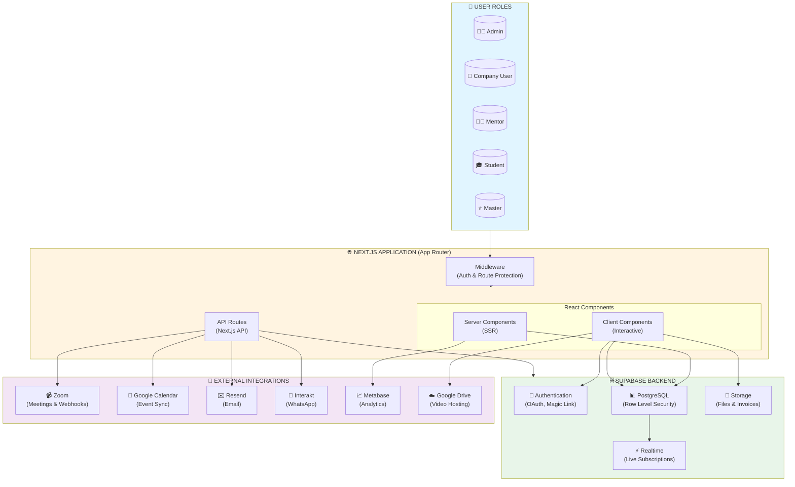

---

## Application Layers

### 1. User Layer

Five distinct user roles with different access levels:

| Role | Access Level | Primary Use Case |
|------|-------------|------------------|
| **Admin** | Full system access | Platform management, user management, cohort administration |
| **Company User** | Admin-level access | Company-specific cohort management |
| **Mentor** | Cohort-scoped | Teaching, resource sharing, student guidance |
| **Student** | Personal scope | Learning, viewing resources, tracking progress |
| **Master** | Cross-cohort | Special access across multiple cohorts |

**Multi-Role Support**: Users can have multiple role assignments across different cohorts and switch between them dynamically.

### 2. Frontend Layer (Next.js)

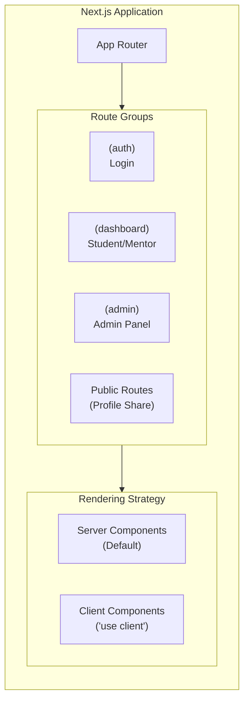

**Architecture Pattern**: Server-first with selective client hydration

- **Server Components** (default): Direct database queries, zero JavaScript to client
- **Client Components**: Interactive features, real-time subscriptions, forms
- **API Routes**: Complex server-side logic, webhook handlers, integrations

### 3. Backend Layer (Supabase)

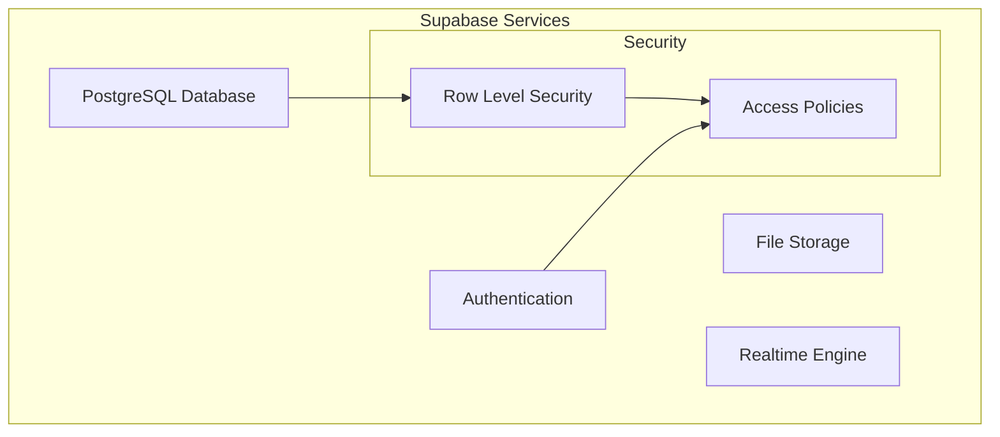

**Key Features**:
- **Authentication**: Google OAuth, Magic Link (OTP), Password
- **Database**: PostgreSQL with Row Level Security (RLS) for data isolation
- **Storage**: Supabase Storage for files, invoices, and user uploads
- **Realtime**: Live data subscriptions for instant UI updates

### 4. Integration Layer

External services that extend platform capabilities:

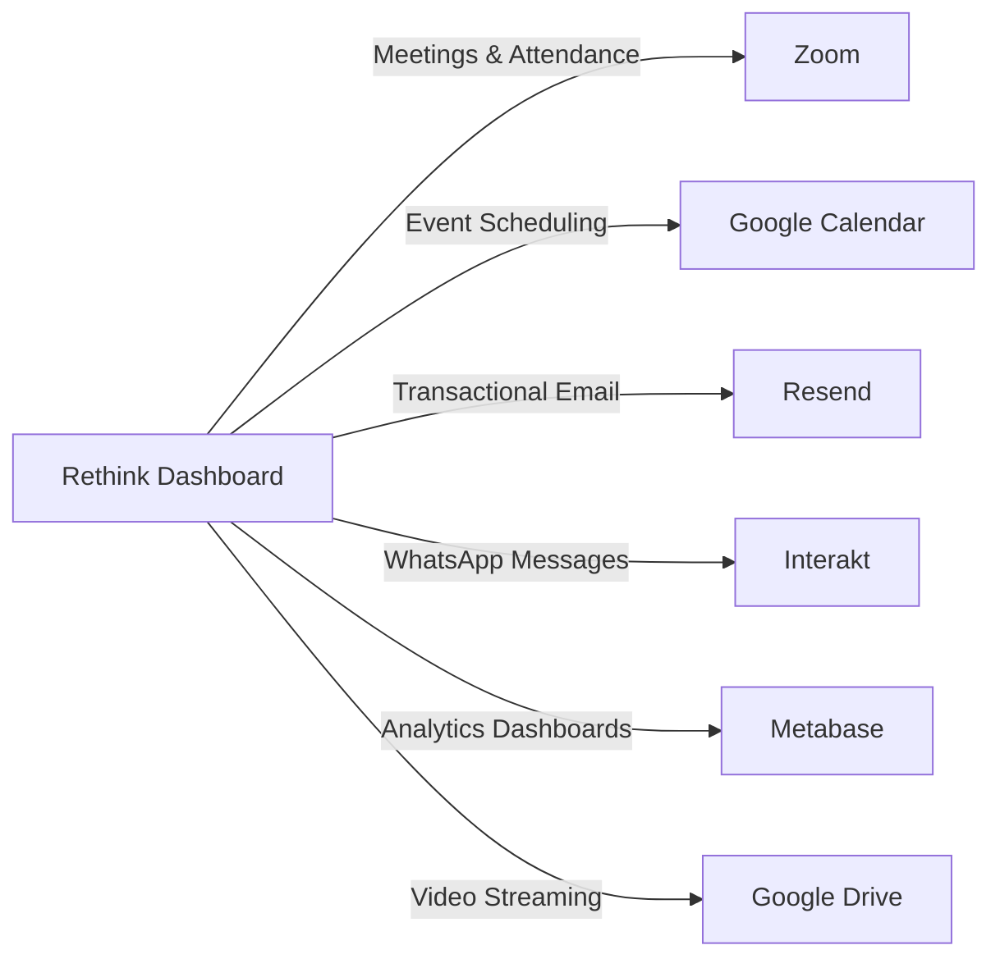

---

## User Roles & Permissions

### Role Permission Matrix

| Feature | Admin | Company User | Mentor | Student | Master |
|---------|-------|--------------|--------|---------|--------|
| **Cohort Management** | ✅ Full | ✅ Full | ❌ View | ❌ View | ✅ View All |
| **User Management** | ✅ Full | ✅ Full | ❌ | ❌ | ❌ |
| **Session Scheduling** | ✅ Full | ✅ Full | 📝 View | 📝 RSVP | ✅ View All |
| **Learning Modules** | ✅ Full | ✅ Full | 📝 Upload | 📝 View | ✅ View All |
| **Attendance** | ✅ Manage | ✅ Manage | 📝 View | 📝 View Own | ✅ View All |
| **Invoices** | ✅ Manage | ✅ Manage | ❌ | 📝 View Own | ❌ |
| **Notifications** | ✅ Send | ✅ Send | 📝 Limited | ❌ Receive | 📝 Limited |
| **Analytics** | ✅ Full | ✅ Full | 📝 Limited | ❌ | ✅ Full |
| **Resource Library** | ✅ Manage | ✅ Manage | 📝 Upload | 📝 View | ✅ View All |

**Legend**: ✅ Full Access | 📝 Limited Access | ❌ No Access

---

## Route Structure

```
/
├── (auth)/                          # Authentication Routes
│   └── login/                       # Login page (Google OAuth, Magic Link, Demo)
│
├── (dashboard)/                     # Protected Student/Mentor Routes
│   ├── dashboard/                   # Main dashboard (sessions, learnings, stats)
│   ├── attendance/                  # View attendance records
│   ├── calendar/                    # Session calendar view
│   ├── invoices/                    # Invoice listing & download
│   ├── learnings/                   # Learning modules & videos
│   │   └── [moduleId]/             # Video player with progress tracking
│   ├── profile/                     # User profile & settings
│   ├── resources/                   # Resource library (files, links)
│   └── team/                        # Cohort team members
│
├── (admin)/                         # Protected Admin Routes
│   └── admin/
│       ├── analytics/               # Metabase embedded dashboards
│       ├── attendance/              # Attendance management & import
│       ├── cohorts/                 # Cohort CRUD operations
│       ├── invites/                 # Bulk user invitations
│       ├── invoices/                # Invoice management & upload
│       ├── learnings/               # Learning content management
│       ├── notifications/           # Notification composer & rules
│       ├── resources/               # Resource management
│       ├── sessions/                # Session scheduling & management
│       ├── support/                 # Support ticket system
│       └── users/                   # User management
│
├── api/                             # API Routes
│   ├── me/                          # Current user profile
│   ├── webhooks/
│   │   └── zoom/                    # Zoom webhook handler (attendance)
│   ├── integrations/
│   │   ├── zoom/                    # Zoom API endpoints
│   │   ├── google-calendar/         # Calendar API endpoints
│   │   └── notifications/           # Notification sender
│   └── [...various endpoints]/
│
├── auth/callback/                   # OAuth callback handler
│
└── share/profile/[slug]/            # Public profile sharing (QR code)
```

### Route Protection

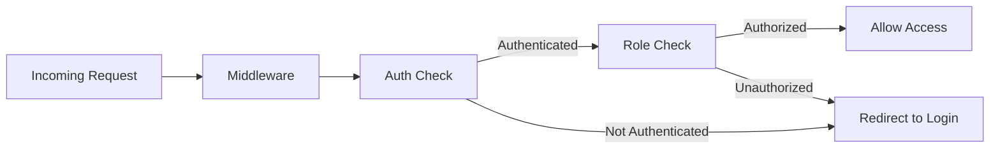

**Middleware** (`middleware.ts`):
- Validates session on every request
- Refreshes tokens automatically
- Redirects unauthenticated users to `/login`
- Protects admin routes based on role

---

## Core Features

### 1. Cohort Management

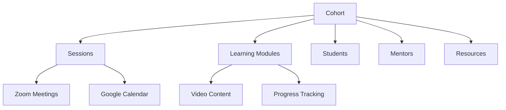

**Features**:
- Create and manage multiple cohorts
- Set start/end dates and status (active, completed, archived)
- Assign students and mentors
- Cross-cohort resource sharing with global modules
- Multi-cohort session support (single session for multiple cohorts)

### 2. Session Scheduling

**Flow**:
1. Admin creates session in dashboard
2. System creates Zoom meeting → `zoom_meeting_id` stored
3. System creates Google Calendar event → `google_event_id` stored
4. Notification rules trigger (e.g., 24hr reminder, 1hr reminder)
5. Students RSVP to sessions
6. Zoom webhook captures attendance when session ends

**Multi-Cohort Support**: Single session can be assigned to multiple cohorts with guest invitations.

### 3. Learning Management System (LMS)

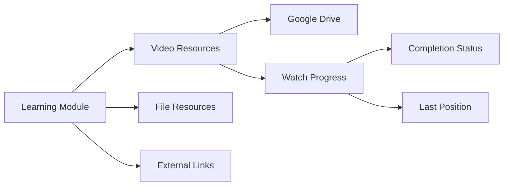

**Features**:
- Week-based module organization
- Video player with:
  - Progress tracking (watch time, last position)
  - Completion status
  - Playback speed control
  - Caption support
- Resource categorization (videos, PDFs, links)
- Favorites system
- Global vs cohort-specific modules

### 4. Attendance Tracking

**Architecture**:
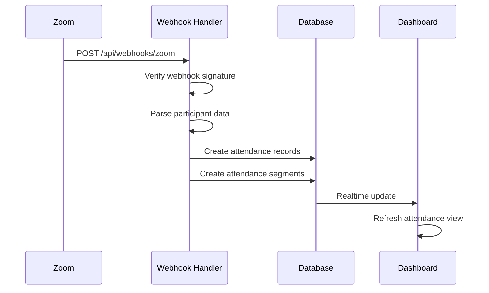

**Features**:
- Real-time attendance capture via Zoom webhooks
- Multi-segment tracking (handles rejoin scenarios)
- Email alias matching for user identification
- Attendance percentage calculation
- CSV import for bulk historical data
- Admin import from past Zoom meetings

### 5. Notification Engine

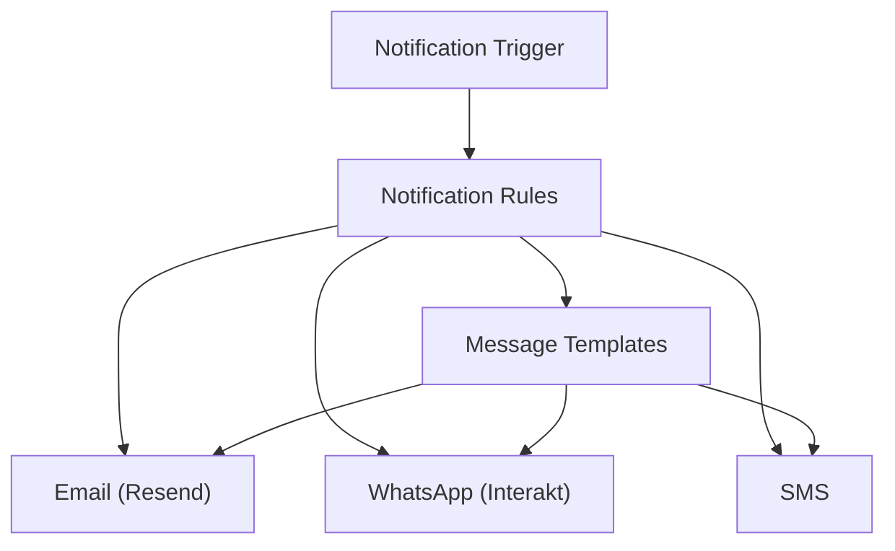

**Features**:
- Rule-based automation (session reminders, new resource alerts)
- Multi-channel delivery (Email, WhatsApp, SMS)
- Template system with variable substitution
- Contact management
- Scheduled sending (cron jobs)
- Delivery analytics and logs

**Trigger Types**:
- Session scheduled
- Session reminder (24hr, 1hr before)
- New resource uploaded
- Invoice generated
- Manual broadcast

### 6. Invoice Management

**Features**:
- PDF generation and storage (Supabase Storage)
- EMI tracking with payment schedules
- Status management (pending, paid, overdue)
- Bulk upload (CSV + PDF files)
- User-facing download portal
- Payment type support (full, partial, EMI)

### 7. Resource Library

**Organization**:
- Folder-based structure
- Week-based filtering
- Keyword tagging
- File type categorization (PDF, Video, Link, Document)
- Favorites system
- Search functionality

### 8. Analytics Dashboard

**Integration**: Embedded Metabase dashboards with JWT authentication

**Metrics**:
- User activity and engagement
- Cohort statistics
- Session attendance rates
- Video completion rates
- Invoice payment tracking

---

## Data Models

### Entity Relationship Diagram

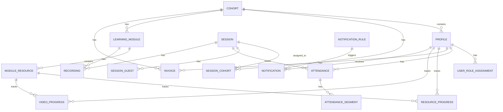

### Core Entities

#### 1. Profile
```typescript
{
  id: uuid
  email: string
  full_name: string
  phone: string
  linkedin_url: string
  portfolio_url: string
  role: 'admin' | 'company_user' | 'mentor' | 'student' | 'master'
  cohort_id: uuid (FK)
  mentor_id: uuid (FK)
  avatar_url: string
  calendly_url: string
  timezone: string
  role_assignments: UserRoleAssignment[]  // Multi-role support
}
```

#### 2. Cohort
```typescript
{
  id: uuid
  name: string
  tag: string (unique identifier)
  start_date: date
  end_date: date
  status: 'active' | 'completed' | 'archived'
}
```

#### 3. Session
```typescript
{
  id: uuid
  title: string
  description: text
  scheduled_at: timestamp
  duration_minutes: integer
  zoom_link: string
  zoom_meeting_id: string
  google_event_id: string
  cohorts: SessionCohort[]  // Multi-cohort support
  guests: SessionGuest[]
}
```

#### 4. LearningModule
```typescript
{
  id: uuid
  title: string
  description: text
  week_number: integer
  cohort_id: uuid (FK, nullable for global modules)
  is_global: boolean
}
```

#### 5. Attendance
```typescript
{
  id: uuid
  session_id: uuid (FK)
  user_id: uuid (FK)
  zoom_user_email: string
  join_time: timestamp
  leave_time: timestamp
  duration_seconds: integer
  attendance_percentage: integer
  segments: AttendanceSegment[]  // Multi-segment tracking
}
```

#### 6. Invoice
```typescript
{
  id: uuid
  user_id: uuid (FK)
  cohort_id: uuid (FK)
  invoice_number: string
  amount: decimal
  payment_type: 'full' | 'partial' | 'emi'
  status: 'pending' | 'paid' | 'overdue'
  pdf_path: string
  due_date: date
  paid_at: timestamp
}
```

**Total Entities**: 13+ core tables with 50+ fields

---

## Authentication & Authorization

### Authentication Flow

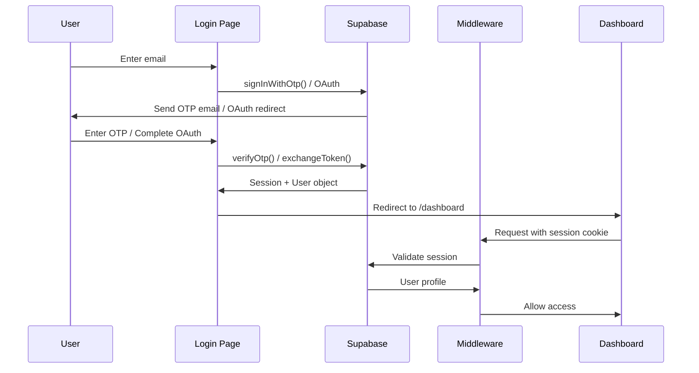

### Authentication Methods

1. **Google OAuth**
   - Supports Gmail and Google Workspace domains
   - Domain whitelisting for access control
   - Automatic account creation for whitelisted domains

2. **Magic Link (OTP)**
   - Email-based 6-digit code
   - No password required
   - Time-limited token

3. **Password Authentication**
   - Set on first login after OTP verification
   - Requirements: 8+ chars, 1 uppercase, 1 number
   - Secure password hashing

4. **Demo Mode**
   - Bypass authentication for testing
   - Demo user stored in localStorage
   - Limited to student role

### Authorization (Row Level Security)

**PostgreSQL RLS Policies**:

```sql
-- Example: Students can only view their own cohort data
CREATE POLICY "Students view own cohort"
ON learning_modules
FOR SELECT
USING (
  cohort_id = (SELECT cohort_id FROM profiles WHERE id = auth.uid())
  OR is_global = true
);

-- Admins bypass all restrictions
CREATE POLICY "Admins full access"
ON learning_modules
FOR ALL
USING (
  (SELECT role FROM profiles WHERE id = auth.uid()) IN ('admin', 'company_user')
);
```

**Client Types**:
- **Browser Client**: User-scoped, RLS enforced
- **Server Client**: User-scoped, RLS enforced
- **Admin Client**: Service role, bypasses RLS (admin operations only)

### useUser Hook

Central authentication hook used across the application:

```typescript
const {
  user,                    // Supabase user object
  profile,                 // User profile from database
  loading,                 // Loading state
  isAdmin,                 // Boolean: admin or company_user
  isMentor,                // Boolean: mentor role
  isStudent,               // Boolean: student role
  isDemo,                  // Boolean: demo mode active
  activeRole,              // Current active role
  activeCohortId,          // Current active cohort
  hasMultipleRoles,        // Boolean: multi-role user
  availableRoles,          // Array of role assignments
  switchRole,              // Function to switch active role
  signOut,                 // Sign out function
  refreshProfile,          // Refresh profile data
} = useUser();
```

---

## External Integrations

### 1. Zoom Integration

**Purpose**: Video conferencing and attendance tracking

**Features**:
- Meeting creation/update/delete
- Past meeting retrieval
- Participant data extraction
- Webhook handling for attendance

**Flow**:
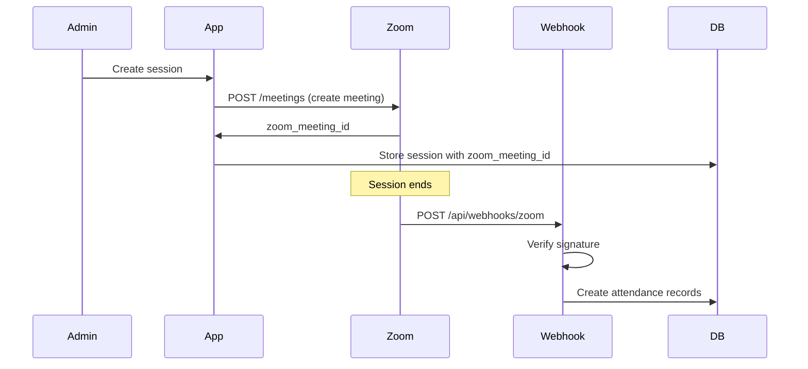

**Implementation**: `/lib/integrations/zoom.ts`

**API Endpoints Used**:
- `POST /meetings` - Create meeting
- `PATCH /meetings/{meetingId}` - Update meeting
- `DELETE /meetings/{meetingId}` - Delete meeting
- `GET /past_meetings/{meetingId}/participants` - Get attendance

### 2. Google Calendar Integration

**Purpose**: Session scheduling and calendar sync

**Features**:
- OAuth 2.0 authentication
- Event creation/update/delete
- Attendee management
- Two-way sync

**Flow**:
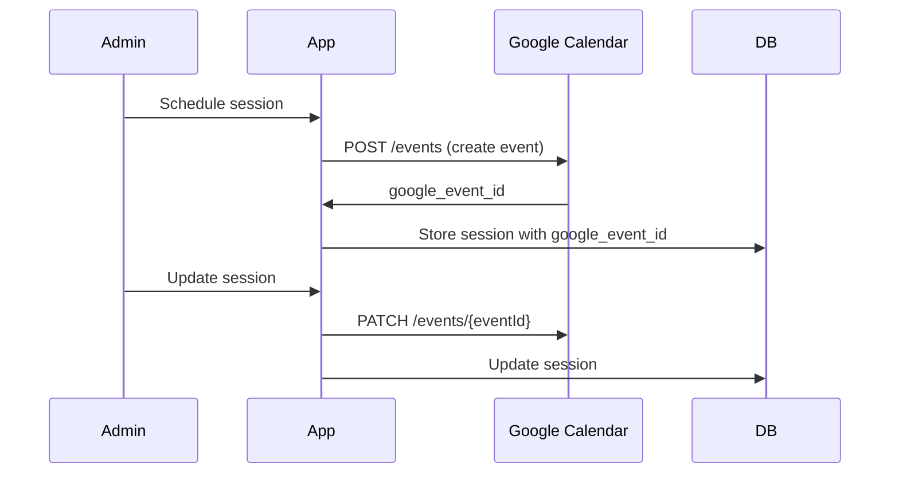

**Implementation**: `/lib/integrations/google-calendar.ts`

**Scopes Required**:
- `https://www.googleapis.com/auth/calendar`
- `https://www.googleapis.com/auth/calendar.events`

### 3. Resend (Email)

**Purpose**: Transactional email delivery

**Use Cases**:
- OTP emails for login
- Session reminders
- New resource notifications
- Invoice notifications
- Bulk invitations

**Implementation**: `/lib/integrations/email.ts`

**Templates**:
- OTP verification
- Session reminder
- Resource published
- Invoice generated
- Welcome email

### 4. Interakt (WhatsApp)

**Purpose**: WhatsApp messaging for notifications

**Features**:
- Template-based messages (for marketing)
- Text messages (24hr window for customer service)
- Phone number formatting and validation

**Implementation**: `/lib/integrations/interakt.ts`

**Message Types**:
- Session reminders
- Important announcements
- Resource alerts

### 5. Metabase

**Purpose**: Analytics and reporting dashboards

**Features**:
- Embedded dashboards with JWT authentication
- User activity metrics
- Cohort performance analytics
- Financial reporting

**Authentication Flow**:
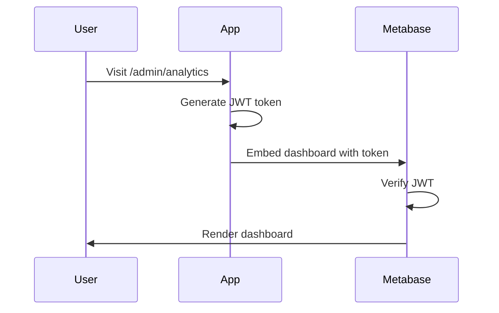

**Implementation**: JWT token generation in analytics page

### 6. Google Drive

**Purpose**: Video hosting and streaming

**Features**:
- Direct video streaming links
- URL conversion utilities
- Embed support

**URL Conversion**:
```typescript
// Convert shareable link to direct streaming URL
https://drive.google.com/file/d/{fileId}/view
↓
https://drive.google.com/uc?export=download&id={fileId}
```

---

## Data Flow Patterns

### 1. Authentication Flow

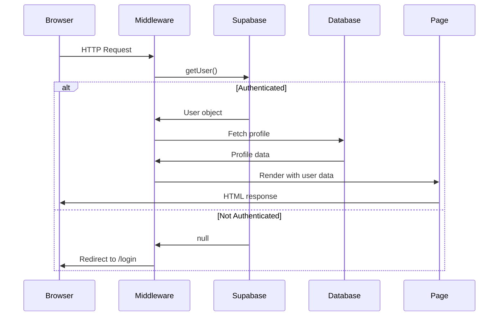

### 2. Session Creation Flow

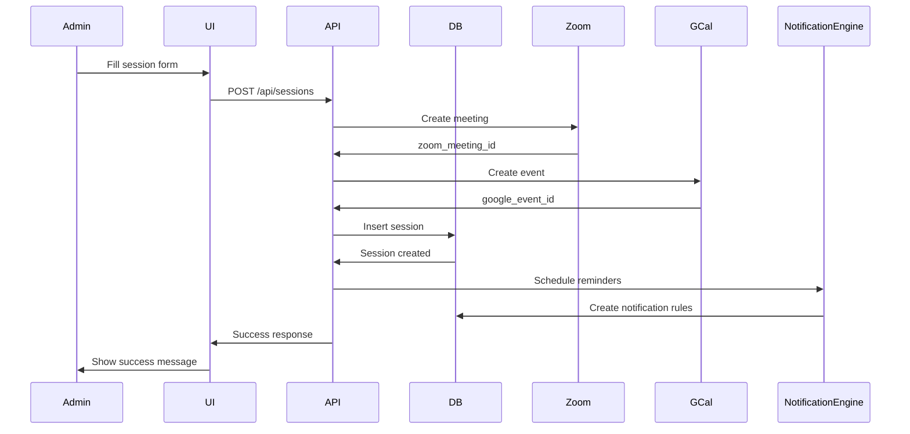

### 3. Attendance Capture Flow

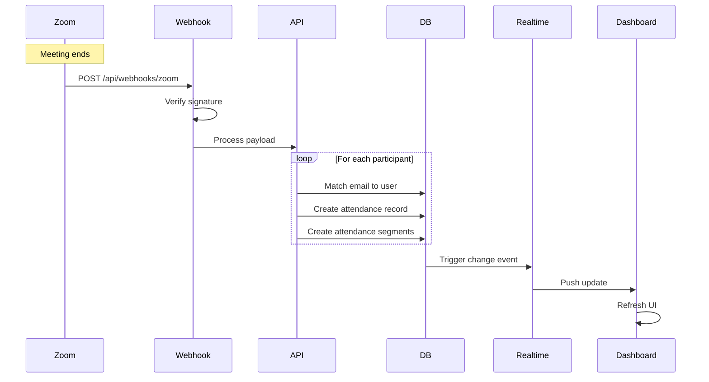

### 4. Video Progress Tracking Flow

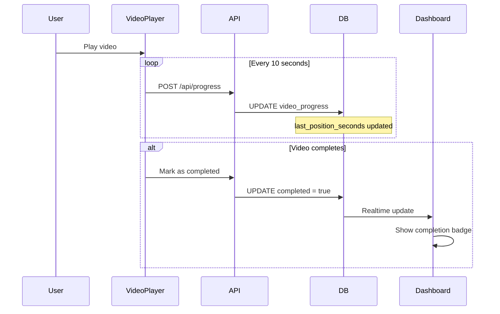

### 5. Notification Flow

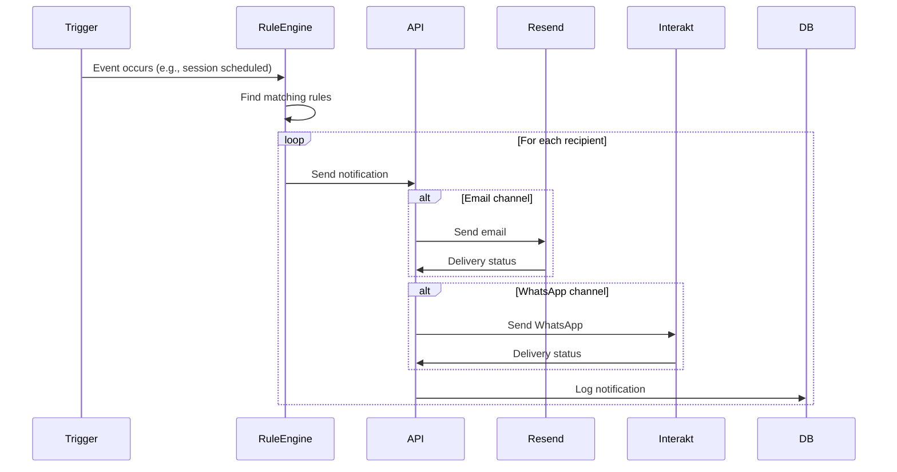

---

## Technology Stack

### Frontend

| Technology | Version | Purpose |
|------------|---------|---------|
| **Next.js** | 16.1.4 | React framework with App Router |
| **React** | 19.0 | UI library |
| **TypeScript** | 5.x | Type safety |
| **Tailwind CSS** | 4.0 | Styling framework |
| **Shadcn UI** | Latest | Component library (Radix primitives) |
| **Lucide React** | Latest | Icon library |
| **Framer Motion** | Latest | Animations |
| **React Hook Form** | Latest | Form management |
| **Zod** | Latest | Schema validation |
| **Sonner** | Latest | Toast notifications |
| **next-themes** | Latest | Dark mode support |

### Backend

| Technology | Version | Purpose |
|------------|---------|---------|
| **Supabase** | Latest | Backend-as-a-Service |
| **PostgreSQL** | 15+ | Database |
| **Supabase Auth** | Latest | Authentication |
| **Supabase Storage** | Latest | File storage |
| **Supabase Realtime** | Latest | Live subscriptions |

### APIs & Integrations

| Service | Purpose | Authentication |
|---------|---------|---------------|
| **Zoom** | Video conferencing | Server-to-Server OAuth |
| **Google Calendar** | Event scheduling | OAuth 2.0 |
| **Google Drive** | Video hosting | Public links |
| **Resend** | Email delivery | API Key |
| **Interakt** | WhatsApp messaging | API Key |
| **Metabase** | Analytics | JWT |

### Development Tools

- **Package Manager**: npm
- **Code Quality**: ESLint, Prettier
- **Version Control**: Git
- **Deployment**: Vercel
- **Environment**: Node.js 18+

---

## Deployment

### Architecture

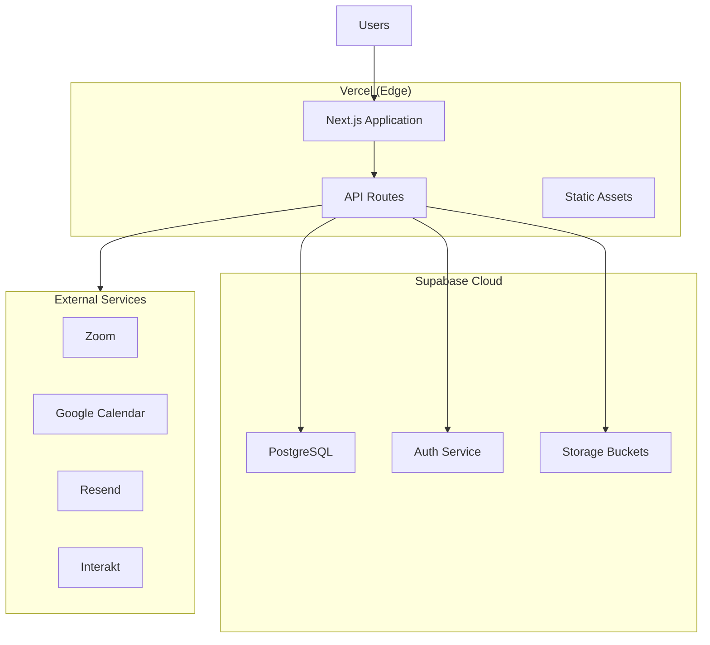

### Environment Configuration

**Required Environment Variables**:

```bash
# Supabase
NEXT_PUBLIC_SUPABASE_URL=https://xxx.supabase.co
NEXT_PUBLIC_SUPABASE_ANON_KEY=eyJxxx...
SUPABASE_SERVICE_ROLE_KEY=eyJxxx...

# OAuth
GOOGLE_CLIENT_ID=xxx.apps.googleusercontent.com
GOOGLE_CLIENT_SECRET=xxx

# Zoom
ZOOM_ACCOUNT_ID=xxx
ZOOM_CLIENT_ID=xxx
ZOOM_CLIENT_SECRET=xxx
ZOOM_WEBHOOK_SECRET=xxx

# Email
RESEND_API_KEY=re_xxx

# WhatsApp
INTERAKT_API_KEY=xxx

# Analytics
METABASE_SITE_URL=https://metabase.example.com
METABASE_SECRET_KEY=xxx

# Application
NEXT_PUBLIC_APP_URL=https://dashboard.rethink.systems
```

### Database Migrations

Supabase migrations managed via SQL files in `/supabase/migrations/`

**Key Tables**:
- `profiles`
- `user_role_assignments`
- `cohorts`
- `sessions`, `session_cohorts`, `session_guests`
- `learning_modules`, `module_resources`, `recordings`
- `attendance`, `attendance_segments`
- `invoices`
- `notifications`, `notification_rules`
- `resource_progress`, `video_progress`

### Hosting

- **Platform**: Vercel
- **Region**: Auto (Edge Network)
- **Build Command**: `npm run build`
- **Output**: `.next/` directory
- **Automatic Deployments**: Git push to main branch

---

## Key Design Decisions

### 1. Server-First Architecture
- **Decision**: Default to Server Components, selectively use Client Components
- **Rationale**: Reduce JavaScript bundle size, improve performance, better SEO
- **Impact**: Faster page loads, lower bandwidth usage

### 2. Supabase as Primary Backend
- **Decision**: Use Supabase for auth, database, storage, and realtime
- **Rationale**: Integrated solution, built-in security (RLS), real-time capabilities
- **Impact**: Faster development, reduced backend complexity

### 3. Multi-Role Architecture
- **Decision**: Allow users to have multiple role assignments
- **Rationale**: Users can be mentors in one cohort and students in another
- **Impact**: More flexible user management, complex permission logic

### 4. Webhook-Based Attendance
- **Decision**: Capture attendance via Zoom webhooks instead of polling
- **Rationale**: Real-time updates, reduces API calls, more accurate data
- **Impact**: Requires webhook infrastructure, dependent on Zoom reliability

### 5. Row Level Security (RLS)
- **Decision**: Enforce data isolation at database level
- **Rationale**: Security by default, prevents data leaks even if application logic fails
- **Impact**: More complex query patterns, requires careful policy design

### 6. TypeScript Everywhere
- **Decision**: Full TypeScript coverage on frontend and API routes
- **Rationale**: Type safety, better developer experience, catch errors at compile time
- **Impact**: Slightly longer development time, significantly fewer runtime errors

### 7. Component Library (Shadcn UI)
- **Decision**: Use Shadcn UI instead of traditional component library
- **Rationale**: Own the code, full customization, no black boxes
- **Impact**: More control, easier debugging, no version lock-in

### 8. Video Hosting on Google Drive
- **Decision**: Host videos on Google Drive instead of dedicated video platform
- **Rationale**: Cost-effective, unlimited storage, easy sharing
- **Impact**: Less video analytics, no adaptive streaming

---

## Security Considerations

### Authentication
- ✅ Multi-factor authentication support (email OTP)
- ✅ OAuth with trusted providers (Google)
- ✅ Secure session management (httpOnly cookies)
- ✅ Automatic token refresh

### Authorization
- ✅ Row Level Security (RLS) at database level
- ✅ Role-based access control (RBAC)
- ✅ Middleware-based route protection
- ✅ API endpoint authorization checks

### Data Protection
- ✅ Encrypted connections (HTTPS)
- ✅ Encrypted data at rest (Supabase)
- ✅ Input validation (Zod schemas)
- ✅ SQL injection prevention (parameterized queries)

### Webhooks
- ✅ Signature verification (Zoom webhook secret)
- ✅ Payload validation
- ✅ Rate limiting
- ✅ Error handling and logging

---

## Performance Optimizations

### Frontend
- ✅ Server-side rendering (SSR)
- ✅ Static asset optimization
- ✅ Code splitting (dynamic imports)
- ✅ Image optimization (next/image)
- ✅ Font optimization (next/font)

### Backend
- ✅ Database indexing on frequently queried fields
- ✅ Connection pooling (Supabase)
- ✅ Query optimization (SELECT only needed fields)
- ✅ Caching strategies (browser cache, CDN)

### Real-time
- ✅ Selective subscriptions (only active data)
- ✅ Optimistic UI updates
- ✅ Debounced updates (progress tracking)

---

## Future Enhancements

### Planned Features
- 📋 Mobile application (React Native)
- 📋 Advanced analytics (custom reports)
- 📋 Gamification (badges, leaderboards)
- 📋 Peer-to-peer messaging
- 📋 Assignment submission system
- 📋 Automated certificate generation
- 📋 Multi-language support (i18n)
- 📋 Offline mode (PWA)

### Technical Improvements
- 📋 GraphQL API layer
- 📋 Microservices architecture for integrations
- 📋 Advanced caching (Redis)
- 📋 Background job queue (BullMQ)
- 📋 Comprehensive test coverage (unit, integration, E2E)
- 📋 Performance monitoring (Sentry, LogRocket)
- 📋 A/B testing framework

---

## Appendix

### Useful Commands

```bash
# Development
npm run dev              # Start development server
npm run build            # Build for production
npm run start            # Start production server
npm run lint             # Run ESLint

# Database
npx supabase db reset    # Reset database (local)
npx supabase db push     # Push migrations to remote
npx supabase gen types   # Generate TypeScript types

# Deployment
vercel                   # Deploy to Vercel
vercel --prod            # Deploy to production
```

### Key File Locations

- **Types**: `/types/index.ts`
- **Supabase Clients**: `/lib/supabase/`
- **Integrations**: `/lib/integrations/`
- **Hooks**: `/hooks/`
- **Components**: `/components/`
- **API Routes**: `/app/api/`
- **Middleware**: `/middleware.ts`

---

**Document Version**: 1.0
**Last Updated**: January 31, 2026
**Maintained By**: Rethink Systems Engineering Team
